# 1.做人不能太老实

## 1》达维多定律：别让规则束缚你的手脚

### 以英特公司的副总裁的名字达维多命名的，也是英特公司的策略。看上去容易，做起来难。

强调的就是创新，创新再创新

我们有时候错过机会就是因为太慎重了。只有敢于冒险，敢于捕捉机会，才能够获得成功

## 案例1：intel产品

## 案例2：渡边正雄购买那须高原开发房地产，非常成功成功

所以，成功需要独具慧眼，要能够根本思维定势，关于和别人不一样。

## 2》做人要对正确的人（值得的人）厚道

对人对事需要量体裁衣，只对合适的人厚道。遇到不厚道的人，我们需要以其人之道还治其人之心

### 例子，周瑜想用孙权妹妹孙尚香来囚禁刘备，结果上了诸葛亮的当，“偷鸡不成蚀把米”

“人不犯我我不犯人，人若犯我我必犯人”。

#### 害人之心不可有，防人之心不可无

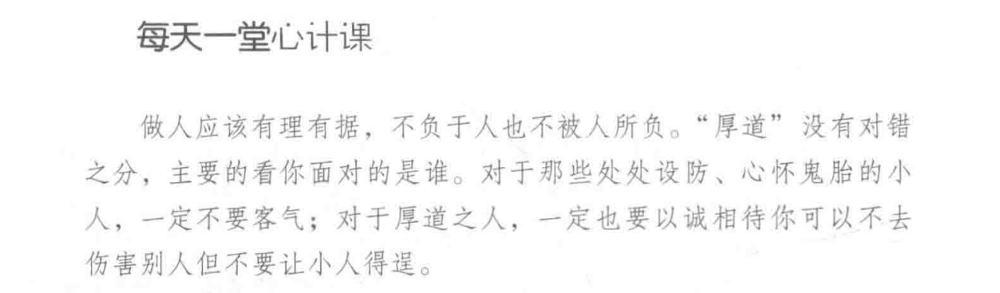

## 3》不怕冷遇，热脸要贴冷屁股

脸皮要厚一点，放下所谓的自尊，“不要面子，才有票子”，要敢于和客户沟通，要笑脸相迎，要投其所好...

### 例子： 王聪，

   开始==》 心高气傲，放不下面子，订单很少，同事孤立

  后来开窍==》有耐心，懂得和人打交道  主管给了他几个重要客户 ---》签了几个大单

### 例子2：刘邦去县令家做客，空许“贺钱一万”，坐到主桌。--》得天下

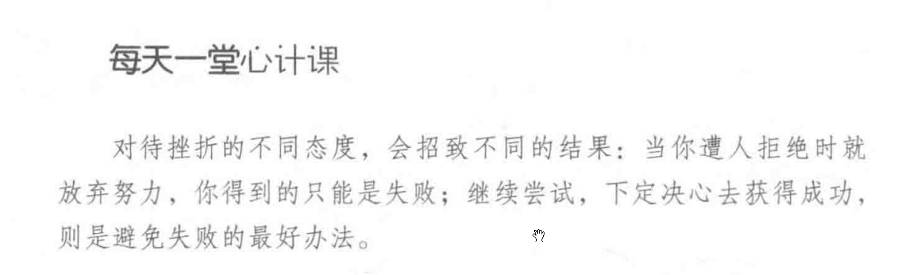

## 4》不要被卖了，还帮着数钱

这个世界上，到处都是小人，和人打交道需要时时小心，处处留神。多想一下如何防备别人。

### 案例，一个朋友帮人家拿行李被栽赃陷害。不要随便帮人家拿行李。可能有毒品。不要随便相信所谓的和人投缘，都是套路。

#### 防止被套了，需要做到下面几点

1.疏远那些老是向你打听你亲近的人的消息的人

2.小心那些“皮笑肉不笑”的人，“明明不好笑，他却笑了”

3.那些不吐不快的话，只能够对父母妻子和孩子说，不要随便对别人说。

4.当你想结束。但是对方却让你重新打开话匣子，此时你需要小心，你说的话可能被利用

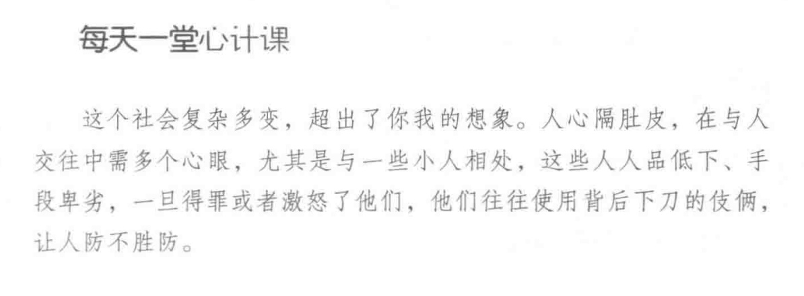

## 5》可以不奸诈，但是不可不‘世故’

你的路很多时候是人家帮你开拓的。不要不懂人情世故。“朋友多了路好走‘。人家帮助过你，你必须记住，并且找机会换人情。”没有关系，寸步难行“

### 案例，汽车销售大王的秘诀： 套近乎

为人处世是我们必须学习的一门功课。

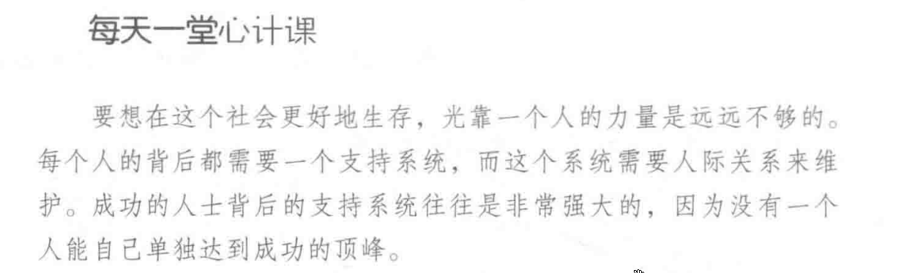

## 6》做人不能太复杂，也不能太单纯

### 老实人活得很累，因为：

不懂得拒绝，什么都往身上揽，还不懂得推脱。。。

### 老实人难以成功，因为：

性格耿直，容易得罪人

爱钻牛角尖，认死理，难以合群

喜欢退让，不主动争取，失去机会。。。

### 例子

小王获得企业的广告业务，是因为他懂得赞美企业的标识，然后和经理谈得很投机，顺利达成目标。需要投其所好，适当赞美。满足经理的虚荣心。

做人太单纯，不争名利，不会防人，很难在社会上立足

做人圆滑，腾挪空间大，也是尊重别人，建立良好关系的需要

自己做不到的或者很难做到的事情，要懂得拒绝。

在圆滑的同时，请记住，诚信为本。别总让人吃亏，也别总是自己吃亏。

做到诚实而不耿直，圆滑而不虚伪

做人圆滑世故不是让你去害人，是让你更好的和别人打交道，同时会更好的保护自己，防范小人。要给对方留下好印象。

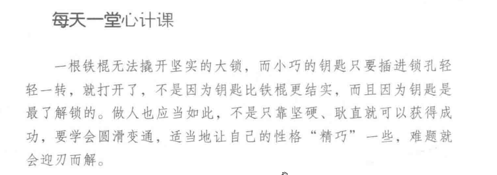

## 7》放弃做好人的想法

好坏没有绝对的标准，符合利益的就是好事，不符合利益的，就是坏事。

当你触犯了别人的利益，即使你做的事情是“好事”，在人家眼里，这个都是“坏事”

不要做“烂好人”：没有原则，没有主见，不能坚持的“好人”。老是以好去讨别人喜欢，对人有求必应，难分是非，宁愿牺牲自己成全别人

### 案例：马东前上司给他塞人，他不懂得拒绝，搞得自己很难堪。

为了达到目标，有时候我们必须放弃“做好人”的想法

很多时候，我们都是被自身的“好脾气”所阻碍，担心失败，处处忍让，错失机会--》导致失败

害怕失败并不能避免失败，只有勇敢面对，才会成功

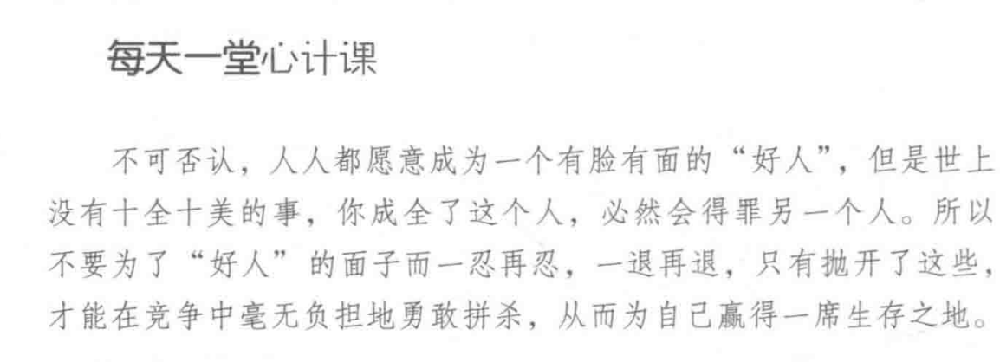

# 2.第二章 做事要有心眼

## 1）宁可得罪10个君子，也不得罪一个小人（不要随便得罪人，但是如果你必须做出选择，那你千万不要得罪小人）

小人做事不讲正道，为到达目的，不择手段，不要明斗，你斗不过他们

### 案例： 秦始皇欲传位给苏扶，立完遗诏就死了，宦官想谋权夺位，杀了苏扶，赵高铲除了李斯

小人为了利益，可以牺牲尊严，用阿谀奉承得到势力，用诬陷诋毁铲除异己

#### 那些是小人？

1.见不得别人好的人(妒忌心强的人)

2.喜欢拉帮结派的人

3.爱奉承的人--没有本事，只会拍马屁

4.不孝顺的人

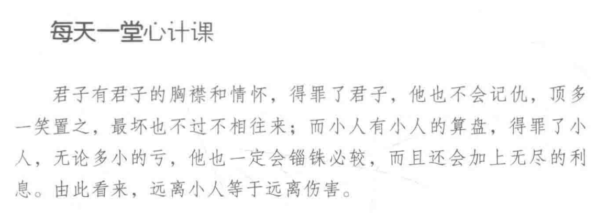

## 2.不去处处迁就别人，否则只能吃哑巴亏

如果一个人办事没有方法，没有原则，只会听别人的。那么他一辈子都不会成功

没有自我的人很容易走弯路，浪费时间，犯错误

### 案例 郭涛进入一家告诉，适逢发展机会-前途一片光明-》老板死了，老板儿子不重用他-》他太听话，不懂得据理力争，做闲职，没有发展前途了。

不要老是顺着别人，做老好人，这样子得不到别人的尊重，还会给直接添加很多不必要的麻烦。

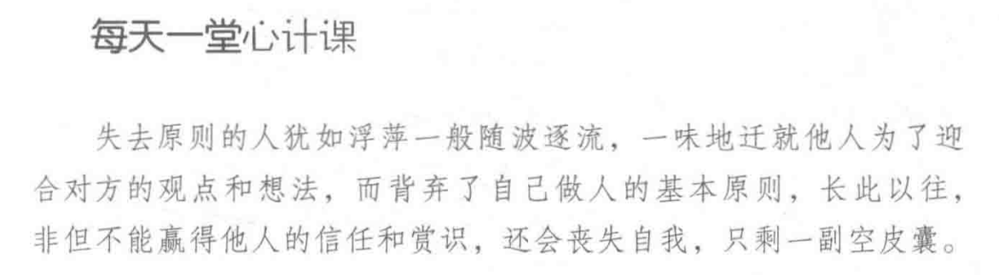

## 3.有时候，不得不说违心话，做违心事

### 案例 越王勾践，忍辱负重，最终打败吴王夫差。

帮吴王牵马，受到责骂也忍受，片区吴王信任然后回到越国。用美女勾引吴王，年年进贡宝物。让吴王以为他甘心归顺。后来打败吴王，称霸诸侯。

“小不忍，则乱大谋”

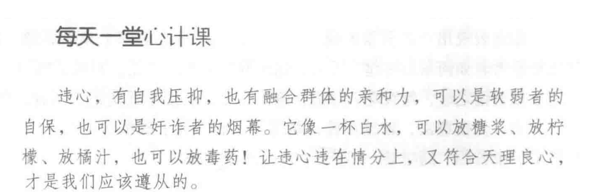

## 4.冷庙热庙都有烧高香，人情放长远

聪明的人都懂得储蓄“人情”。

你要想得到别人的帮助，必须与他们有“交情”

不一定要找那些有权有势的人，因为找他们帮忙的人很多，他们记不起你。这些人眼界高，不会把你放心上

“功夫用在平时”

需要经常联络，长时间不联络，再好的感情都会生疏

要留意那些暂时没有地位的人和那些昔日高高在上，现在失去势力的人，这些人投入相对少，在关键时候有意想不到的回报。

### 案例，有一位领导失去势力，甚至想自杀。他的一位部下帮助他恢复自信，然后他重新振作，发展很好。他非常感谢那位部下，大力提拔，而且退休后让他接自己的位置

### 几个要点

#### 1>留意那些怀才不遇的人，多多交往，佳节送礼

#### 2>结交那些暂时没有发达的“英雄”，有思想，有能力，暂时没有机遇的人

#### 3>不要忽视哪些能力平庸的人。这些人也有可能成为厉害的人，如果你在他发迹之前和他有深厚的交情，他发迹之后不会忘记这一份交情。

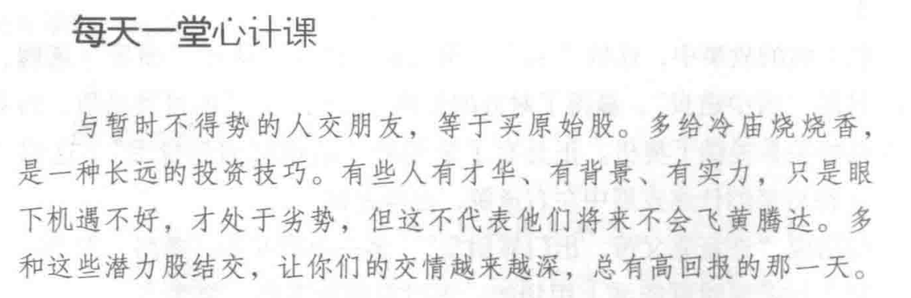

## 5.做事要果断，拒绝做一个“不好意思”的人

不肯放下面子，说出自己的难处和不堪，不知道拒绝别人，就会有哑巴吃黄连，有苦说不出

### 案例，李东付完房子首期，只剩下1000元，却不懂得拒绝姑妈，死要面子活受罪，结果姑妈帮忙结账。

过多的不好意思，给人一种矫揉造作的印象

凡事要量力而为，做不到的要坚决拒绝。要想有面子，就不要不好意思，给自己留一条后路

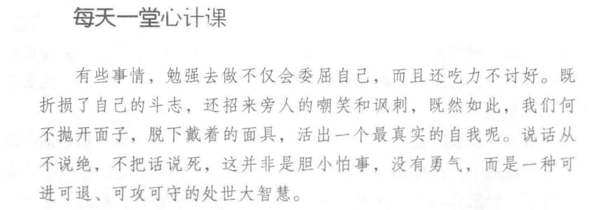

## 6.要比别人聪明，但是不要说你比别人更聪明

爱耍小聪明，懂一点本事生怕别人不知道，凡事喜欢“露两手”，这就是招灾引祸的根源

### 案例 美国南北战争时期的高尔顿将军，虽然有本事，但是毫无城府，爱吹牛--“战争贩子”，观看演习，提交意见书，强烈批评演习训练无素2次，犯众怒，被撤职

不要把别人看成一无所知，上司不喜欢采纳下属的意见，你有太多的意见，你就会最先被淘汰

不要认为自己高人一等，要吧光彩让别人，那样别人才会接纳你，帮助你

### 案例  一只好炫耀自己身手敏捷的猴子被乱箭射死

做人待事，要做到喜怒不形于色。不要过分表现自己的聪明。

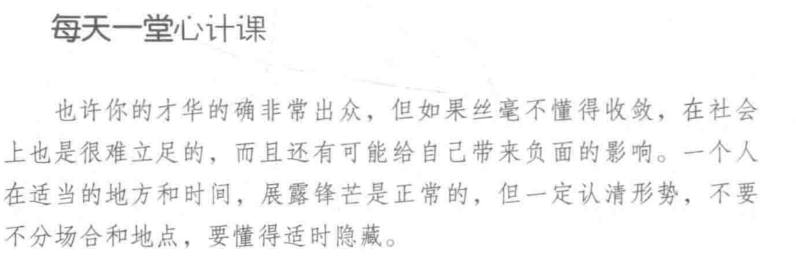

## 7.永远不要挡别人的财路

断人财路，就是别人的敌人，人家就想除掉你。

### 案例 甲的工厂和乙的工厂都在做同一个项目，乙的工厂资金雄厚，比甲先上市项目，甲就写匿名检举信去举报乙，还得乙的工程停产一个月，损失很多，乙以其人之道还治其人之身，结果甲也被质检部门检测，产品因为质量不好而被停产。这就是断人财路的下场

不要与人为敌，是做人做事的基本原则。"夺人路者人还夺"，你挡人家财路，人家必定也会断拿到财路，导致两败俱伤。

### 如何做到不挡人财路

1》低调做人，高调做事，明白树大招风的道理

2》凡是做到“留一步，让三分”。原则性问题必须要坚持，小事可以退让。

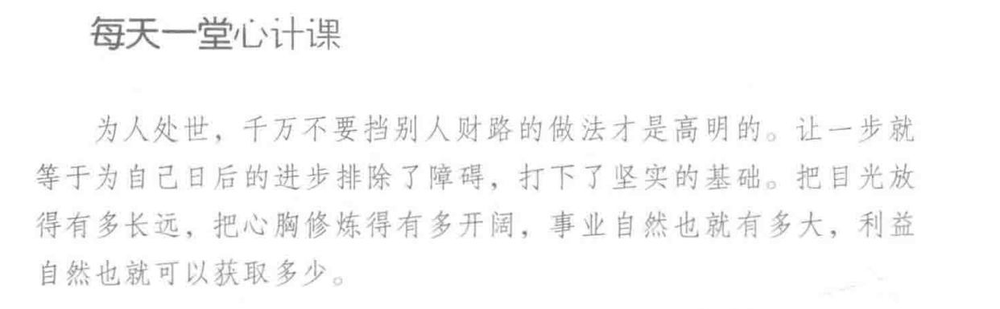

# 3.在反洗脑和反操控的心理博弈中获胜

## 1》懂得适时进退，才能保全自己

“会生活的人，从来都不是争强好胜，咄咄逼人，而是在必要的时候后退一步，适当牺牲一点点利益”

“高处不胜寒” 

“盛名之下，其实难副” ：意思是说享有盛名的人，他的实际情况未必与名声相称，也就是名过其实。多用来提醒人要有自知之明，要谦虚谨慎。

拼搏过程中，我们需要功成身退，见好就收。隐退是避祸的法子。

把握号进与退的时机和分寸，是事业成功，前途广阔的基础。

### 案例 庞涓害孙膑的故事，最后庞涓被孙膑打败，下场悲惨，断送了生命。只是因为他为了一时的利益出卖自己的好友。

‘’鱼与熊掌不可兼得，舍鱼取熊掌‘’

"忍一时风平浪静，退一步海阔天空"。争一时不如争千秋

懂得留余地，做到进退自如

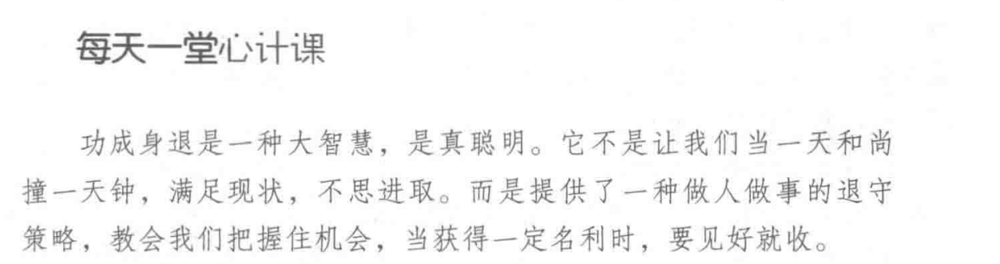

## 2》强也示弱，给他人留足面子

要把赞美，鲜花，掌声和羡慕无偿让给别人。在别人需要帮助的时候，及时伸出援手

表现自己柔弱的一面，可以麻痹对手，获取喘息的机会，趁机壮大自己，打败对手。

当形势不利于自己的时候，需要隐藏自己强大的一面，避免他人嫉妒和暗算。

### 案例 东吴夺荆州。吕蒙-》懂得示弱-》陆逊-》麻痹关羽-》关羽调走后备兵-》吕蒙和陆逊乘机夺取荆州。

在竞争中，要善于选择示弱的内容： 成功的人对别人说自己的失败经历，给人一种成功不易的感觉。有一技之长的人，说自己在其他方面一窍不通。

只有懂得在适当的时候示弱，才能够蓄积力量，转弱为强

强者示弱，给人谦虚，和蔼，心胸广阔和平易近人的印象

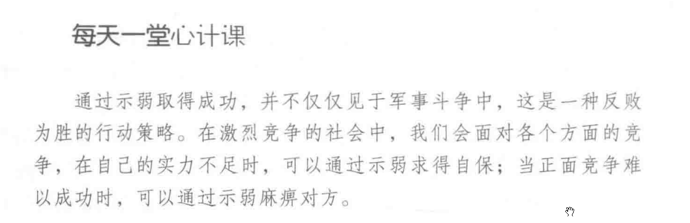

## 3.别人都站着，你就别坐着，不做孤独的人

首先，要知道这个社会有哪些规则，不懂得一大局为重，照顾自己的人，会四面受敌

"别人都站着，你就别坐着",是行为处事的心里契约

以大局为重，形成利益共同体

### 案例 祢(mi)衡之死  得罪曹操-》曹操把他送给刘表-》得罪刘表-》刘表把他送给黄祖-》得罪黄祖-》黄祖杀了他。死的时候才26岁。

社会其实就是一片是非之地，是虎狼出没的地方

太强调个性，就会与社会和他人为敌

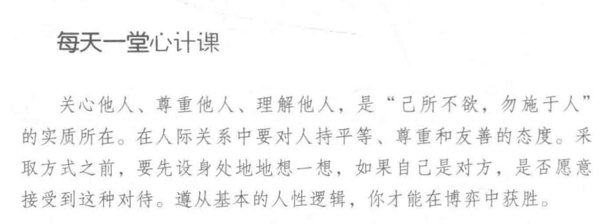

## 4.以其人之道 还治其人之身

对于不怀好意的人，必须以其人之道 还治其人之身，如果你做不到，他们就会认为你好欺负，下一次还会继续害你

### 案例 晏子使楚 楚王用武士捆绑一个偷窃的齐国人来羞辱晏子。反而被晏子针锋相对，自讨没趣。

受到别人攻击后，最直接的方法就是用同样的方式还击，这样的效果最好。

### 关键点

1> 模棱两可，模糊表态-》不清楚别人的来意，先搞清楚他的意图，然后才能有些反击

2> 面对不怀好意的人，心态要稳定。保持淡定，冷静应对

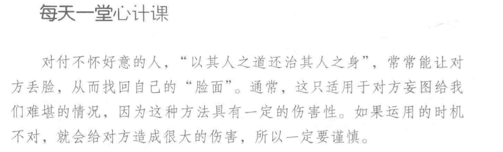

## 5.将计就计，不言不语事可成

将计就计，假装中计，然后设置一个圈套让对方中计

"欲闻其声反默，欲张反敛，欲高反下，欲取反与" ,意思就是：**想要达到某个目的，往往要先采取与其相反的手段或姿态。** 运用的是高超的逆向思维和谋略手段，通过隐蔽自己的意图来诱导和揣摩对方的真实想法

**欲闻其声，反默**

- 想要听到对方的话（探听对方的言论、想法），自己反而要先保持沉默，不表态，以此引对方多说。 

**欲张，反敛**

- 想要让对方充分暴露、敞开胸怀或扩张势力，自己反而要先收敛锋芒、保持低调，放松对方的戒备。

**欲高，反下**

- 想要使自己处于崇高、主导或优越的地位，自己反而要先表现得谦卑、处于下方，以退为进。

**欲取，反与**

- 想要从对方那里索取、得到利益，自己反而要先给对方好处或给予施舍，这是“将欲取之，必先与之”的策略

### 案例：李建成想杀李世民结果被李世民反杀的故事

背景，突厥进犯中原，李建成要求唐高祖封李元吉为元帅，然后把李世民的大将和精兵都调拨给李元吉，然后就想杀害李世民。有人泄密给李世民，最终李世民决定放手一搏。在玄武门射杀了李建成和李元吉。然后拍一员大将说他们想叛变。秦王李世民已经把他们杀了。后来唐高祖让位给李世民，也就是后来的唐太宗。

凡事都有谋定而后动，先考虑清楚后果和过程，还有懂得适时而止，才会又不错的收获

面对突如其来的变故，需要冷静处理

将计就计的关键就是识破敌人的计谋和他们想达到的目的。

要利用对方的圈套再做一个圈套，在对方的陷阱之外再挖一个陷阱，让对方自吃其果

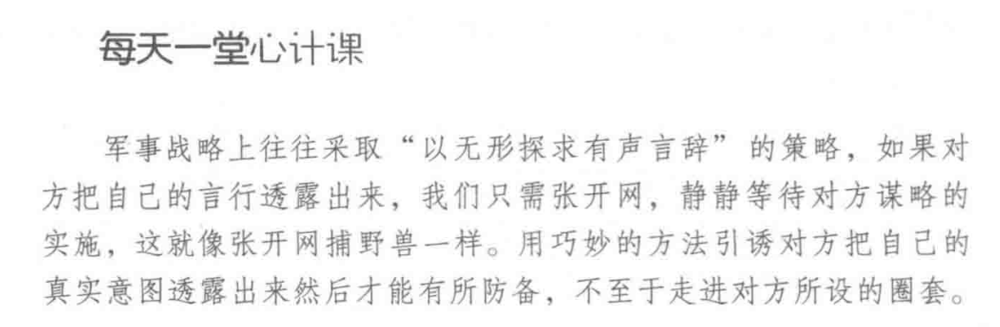

## 6.丢掉妇人信，该翻脸就翻脸

### 案例 猎犬不忍心杀狼，反而差一点让狼给杀了

对敌人仁慈，就是对自己残忍

比如： 楚汉相争，项羽放虎归山，最终只能够"霸王别姬"

关键2点：

1.锻炼自己的思维和判断，用理性和智慧来引导自己的行为

2.记住，"妇人之仁"是一种负债。

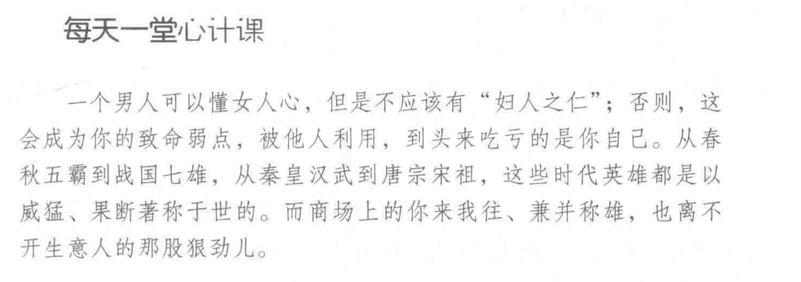

# 4.互惠心计定律：精明处世，讲功利也讲感情

## 1>"双赢"效应： 与其你死我活，不如你活我也活

### 案例 李嘉诚与地铁公司和汇丰银行合作成功。

要顾及对方的利益，对方无利，自己就无利。舍得让对方得利，这样自己才能获得较大的利益

我们在人际交往中要学会合作和团队协作。很多跨国集团的招聘条件，就是要懂得团队精神和"合作态度"

### 案例 微软和评估的竞争，微软占优势，苹果出现危机。比尔盖茨没有置苹果于死地。反而帮它渡过难关。1997年微软投资1亿美金救活苹果。

在必要是时候，让一步，反而会给自己带来更大的好处

摩根说: 竞争是浪费时间，合作才是繁荣稳定之道

"有钱大家赚，大家都发财"

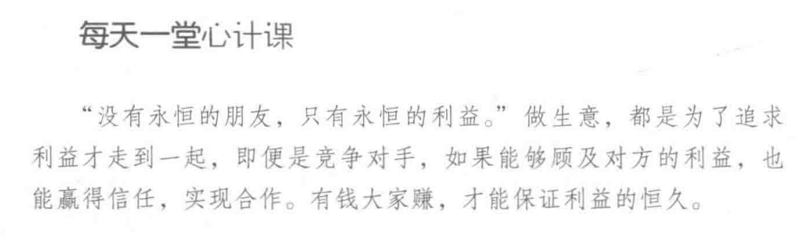

## 2》坚持利益共享，才能赢得合作机会

时刻**关注**对方的利益和诉求，（不是一味迁就），坚持共享精神，损人利己，合作只会走向衰败。

"以德为本，以义为先，以义致利"
"以和为贵，散财聚人"

### 案例 李嘉诚主动放弃袍金，获得股东们的一致好评和对"长实系"的信任。

要有"千金散去还复来"的智慧于勇气。

### 案例2 苏宁老总张近东分配股权给管理团队的故事

把"职业管理人"变为"事业管理人"

小胜凭智，大胜靠德

小利不舍，大利不来

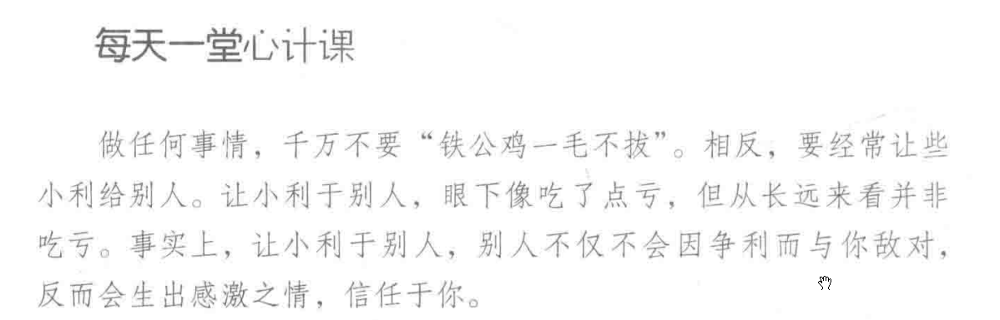

## 3》共生效应：好处自己不独吞，荣耀勿独享

维持长久关系，要把握"利益平衡"

### 反面教材：八佰伴失败案例，疯狂压价，导致供应商无法接受，被迫中断合作关系

"成人之美，方能惠己"

关系就是照顾到自己，也想到别人，你中有我，我中有你

利益分配出现问题，你和他人的关系就无法继续下去

要想长久，利益别独吞

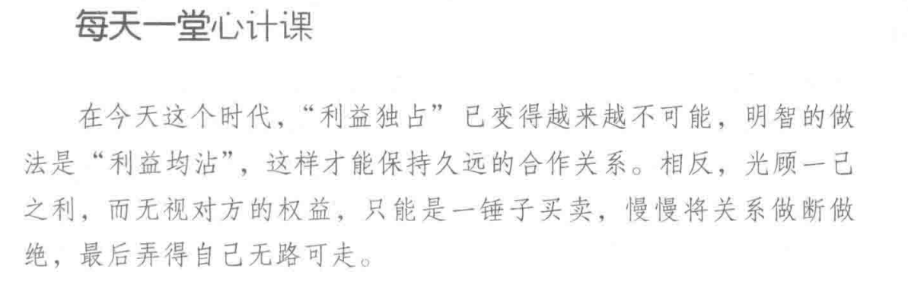

## 4》关键时刻不妨屈就一下

与人发生矛盾和冲突的时候，在合适的时候自动给对方让步，让他做英雄，这才是做人处事的上策

为哪些寻常小事而大动干戈，殊死相争，其实毫无意义

与人发生矛盾和冲突的时候，必要是忍耐和屈就，体现你的心胸和气度，是成大事的基本修养

### 案例 蒋琬对杨戏的做人方式

屈就别人，并不是毫无原则的妥协，而是在特定场景下的宽仁之心

懂得屈就他人，是一种和睦的价值追求

如果只考虑自己的感受，不顾及他人的需求，就不会有好人缘，难成大事

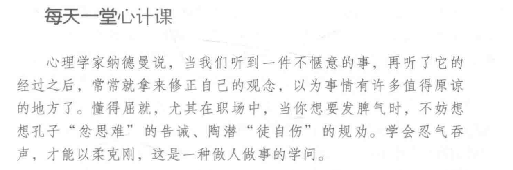

## 5》感情投资，花费少，回报率高

对人来说，物质需求是低级需求，精神需求才是高级需求，也就是说，我们需要满足他人的精神需求

在人员激励中，多给予情感激励，少给物质激励，这样既省钱又效果好

情感投资花费最少，回报率最高

### 案例 日本麦当劳的社长藤田田的情感投资措施：为员工以及家属预订病床，把员工的生日作为个人公休日

#### 进行情感投资，要做到下面几点

1.经常联系，多沟通，聊聊天，吃吃饭，小礼物，祝福语。。。

2.选择良好的沟通环境，从而增进感情

3.用长远的眼光看问题。切忌："平时不烧香，急时抱佛脚"。平时加强往来，在有需要的时候就好得到帮助。

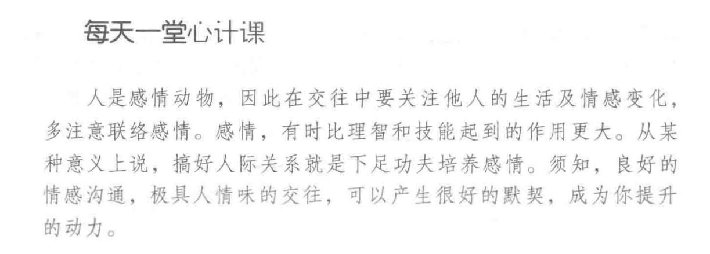

## 6》信用是你人生最大的资产

诚信是为人处世的最基本准则

”人无信不立“

"一言既出，驷马难追"

”君子一言，快马一鞭“

一个人只有诚实待人，不说假话，不骗他人，才能够在社会上立足

### 案例 诸葛亮守信用，让服役期满的老兵按时回家，结果士气大振，最后赢得战争。

生意要做大，必须科学管理，诚信经营

李嘉诚上：”有些生意，给再多的钱，我也不做，已经知道对人有害，就算社会允许做，我都不做“ （诚信原则）

要以真诚换人性，"精诚所至，金石为开"

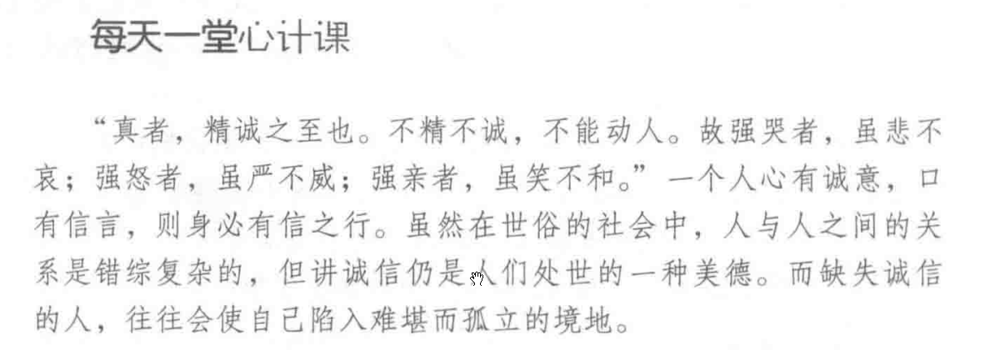

# 5.低调心计学：隐藏锋芒，聪明人都懂得自我保护

 低调做人，高调做事

低调的几个好处

对手不容易发现你的性格弱点，守住自己的阵地赢得给予，避免过度竞争

## 1》学会在低调中修炼自己

在低调中修炼自己，寻找机会，学会低调，能够在没有人关注的时候一飞冲天。学会低调，能够在隐蔽中养精蓄锐，实现胜人一筹的突变。

不要刻意去炫耀自己的才能，知道什么时候该展现才能，什么时候该收敛锋芒。

当时机不成熟，就韬光养晦。

处于弱势，不是真的弱，是为了减少阻力，避开障碍，是一种睿智之举。

### 案例 刘备被吕布夺去徐州，无处藏身，只能投奔曹操，被汉献帝确认了"皇叔"身份，封为左将军，刘备知道曹操的野心，就刻意隐藏锋芒。曹操请刘备喝酒，问他谁是当今天下英雄并且否认了刘备列举的人，说：只有你和我才是当今的英雄。刘备假装被雷吓到，躲过了曹操的猜疑。这就是"青梅煮酒论英雄"

大丈夫需要学会相时而动，趋利避祸，这样才不至于被人算计，遗憾终生

暂时收敛锋芒不是消极回避，而是由智慧的应对敌人的策略，一旦时机成熟，就可以一举攻破对方

### 如何保持低调？

#### 1）在心态上要低调。

​      不太把自己当回事，不要产生自满心理，不断充实自己，完善自己

#### 2）姿态上要低调

​     懂得谦卑的人，将得到人们的尊重，不争先，不露真相。

​     低调做人，往往会赢得对手的资助，最后不断走向强盛，甚至到最后反过来让对手折服。

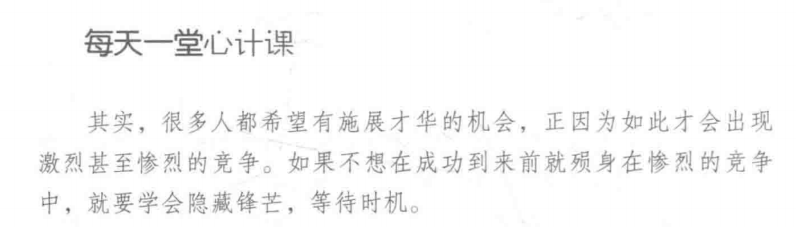

## 2》谨慎心，什么时候都不能丢

​      害人之心不可有，防人之心不可无。

​      多长2个心眼，防范于未然，是融通处世，一生顺达的前提条件

​      我们需要保护好自己的隐私，否则可能没有容身之所

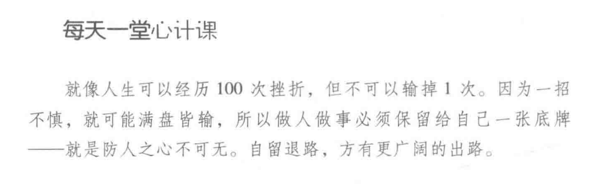

## 3》任何时候都不要往枪口上撞

在关键的时刻，撞到枪口，会被被人打入谷底，甚至丢了身家性命.

与人交往，要注意对方的情绪状态，不要撞到枪口。

唯有把握好火候，不冲撞他人，才容易被认可，被支持，成大事。

### 反面教材： 杨修之死，是从“鸡肋”两个字中解析出曹操想退兵，这是扰乱军心，犯了大忌，遭曹操斩首

做任何事情，都需要看清时局，把握好对方的心意

凡事都是顺势而为，不要逆流而上。

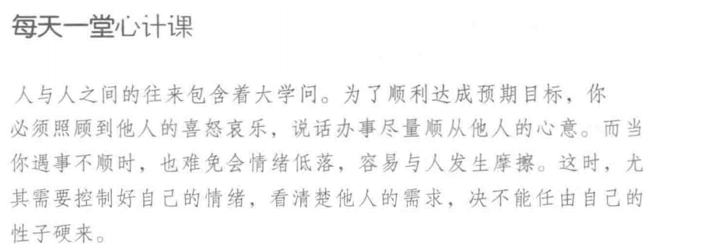

## 4>锋芒毕露的人，没有好果子吃

一个人的成功，靠的不仅仅是个人的能力，专业技能，更需要我们善于做人处事，在生活中巧妙的推销自己，不要一味争强好胜。

现代社会纷繁复杂，需要有一套求生存，谋发展的真本事。

做事不要太张扬，不要锋芒毕露，否则就会四面树敌，寸步难行

低调做人是一种智慧，即使能力高于别人，也要藏拙，与人和善。

### 反面教材，关羽败给"孺子"

关羽之所以失败，是因为他为人盛气凌人，不识大体，排斥诸葛亮和黄忠，还和盟友东吴闹翻，最后败走麦城

人在社会，就好像一块石头被溪水打磨成鹅卵石。刚开始，石头有许多棱角，随着时间的推移，石头的所有棱角都被打磨的很光滑，然后石头变为圆滑的鹅卵石。说明不是社会要来适应你，而是你要改变自己来适应社会。

一个人总和别人碰撞，摩擦，总是让人感觉不舒服。

做人棱角分明，斤斤计较，纵使你能力非凡，也会注定失败

当我们志得意满的时候，切记不可趾高气昂，目空一切，不可一世，否则将成为众矢之的。

### 案例 燕王朱棣装疯卖傻，最后夺取皇位的故事

装疯卖傻只是为明哲保身，等待时机。

"和若春风，肃若秋霜，取象于钱，外圆内方"，是指做人要对外圆滑，识时务，进退自如，对内是指做人要有正气，有自己的主张和原则，不被他人左右。

# 进度：page72

